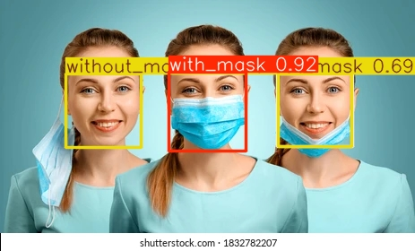

# 😷 Face Mask Detection using YOLOv8

> Real-time detection of **with mask**, **without mask**, and **incorrectly worn mask** using YOLOv8 — wrapped in a beautiful Streamlit web app!


---

## 📸 Demo

<div align="center">
  <table>
    <tr>
      <td><strong>Input Image</strong></td>
      <td><strong>Detection Result</strong></td>
    </tr>
    <tr>
      <td></td>
      <td></td>
    </tr>
  </table>
</div>

---

## 🧩 Project Structure

```
face-mask-detection/
│
├── model/
│   └── best.pt                  # Trained YOLOv8 model weights
│
├── notebook/
│   └── train_model.ipynb        # Complete training notebook (Google Colab)
│
├── assets/                      # Screenshots & demo images
├── app.py                       # Streamlit web application
├── requirements.txt
├── data.yaml                    # Dataset configuration
└── README.md
```

---

## 🚀 Features

- Accurate 3-class detection: `with_mask` ✅ · `without_mask` 🚫 · `mask_weared_incorrect` ⚠️  
- Simple & interactive Huggingface web interface  
- Upload image or use webcam (optional)  
- Lightning-fast inference with YOLOv8 nano  
- Trained on free Google Colab GPU  


---

## 🧰 Technologies Used

| Component       | Technology                                                                 |
|-----------------|----------------------------------------------------------------------------|
| Model           | [Ultralytics YOLOv8](https://github.com/ultralytics/ultralytics)           |
| Programming     | Python 3.10+                                                               |
| Web Framework   | [Streamlit](https://streamlit.io)                                          |
| Training Platform | Google Colab (Tesla T4 GPU)                                              |
| Dataset         | [Face Mask Detection ~12K Images](https://www.kaggle.com/datasets/andrewmvd/face-mask-detection) |

---


**Training Command Used:**
```python
from ultralytics import YOLO

model = YOLO("yolov8n.pt")  # Load pretrained nano model
results = model.train(data="data.yaml", epochs=25, imgsz=640, batch=16)
```

---

## ⚙️ Local Setup & Run

### 1. Clone the repository
```bash
git clone https://github.com/GhaiAyush/Face-mask-detection.git
cd face-mask-detection
```

### 2. Install dependencies
```bash
pip install -r requirements.txt
```

### 3. Run the app
```bash
streamlit run app.py
```
## 📸 Live Demo

Try the app instantly on HuggingFace:

👉 **https://huggingface.co/spaces/ayushghai/face-mask-detection**

No installation needed — upload an image or capture live with your webcam!

---


---

## 🏆 Model Details

- **Architecture**: YOLOv8n (nano – fastest & lightweight)  
- **Epochs**: 25  
- **Image Size**: 640×640  
- **Classes**: `with_mask`, `without_mask`, `mask_weared_incorrect`  
- **Hardware**: Google Colab Tesla T4 GPU  

---

## 👥 Team & Contributions

| Member | Role | Contributions |
|--------|------|---------------|
| ⭐ **[Ayush Ghai](https://github.com/GhaiAyush)** | Lead Developer & Project Head | - Designed overall system architecture<br>- Trained YOLOv8 model<br>- Built Streamlit UI + webcam mode<br>- Deployed on HuggingFace Spaces<br>- Wrote complete documentation |
| **[Sumit Agrawal](YOUR_LINK_HERE)** | Frontend & UI Engineer | - Improved UI/UX<br>- Helped test detection pipeline<br>- Assisted in deployment & final polishing |
| **[Tarun Kodi](YOUR_LINK_HERE)** | Research & Model Optimization | - Helped improve model accuracy<br>- Worked on dataset refinement<br>- Suggested optimizations for YOLO performance |
| **[Gowri Shankar](YOUR_LINK_HERE)** | Testing & Documentation Support | - Performed feature testing<br>- Helped prepare final report<br>- Assisted in deployment verification |


## 🌟 Acknowledgements

- Dataset by [andrewmvd](https://www.kaggle.com/andrewmvd) on Kaggle  
- Huge thanks to **Ultralytics** for YOLOv8  
- **Huggingface** for making deployment so easy  
- Google Colab for free GPUs ❤️  

---

💬 **Enjoyed this project? Give it a ⭐ and share with friends!**

